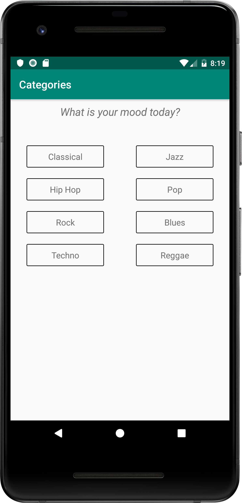

# Android Tour Guide app
Musical structure app for Udacity Android Basics Nanodegree Program by Google. 

# Description
Developed and designed a music playing app that displays the list of available songs in a ListView,
navigates to a details screen of the currently playing song, and uses explicit intents to navigate around the app.

# Requirements
- The app contains multiple activities, each labelled, which together make a cohesive music app.
- The app uses a custom adapter to populate the layout with views based on instances of the custom class.
- ListView, Multiple activities, Explicit Intents

# Additional libraries
- [Butter Knife](https://github.com/JakeWharton/butterknife) 

# Screenshots

<pre>PROJECT LICENSE

This project was submitted by Janas Chatkevicius as part of the Nanodegree At Udacity.

As part of Udacity Honor code, your submissions must be your own work, hence
submitting this project as yours will cause you to break the Udacity Honor Code
and the suspension of your account.

Me, the author of the project, allow you to check the code as a reference, but if
you submit it, it's your own responsibility if you get expelled.

Copyright (c) 2018 Janas Chatkevicius

Besides the above notice, the following license applies and this license notice
must be included in all works derived from this project.

MIT License

Permission is hereby granted, free of charge, to any person obtaining a copy
of this software and associated documentation files (the "Software"), to deal
in the Software without restriction, including without limitation the rights
to use, copy, modify, merge, publish, distribute, sublicense, and/or sell
copies of the Software, and to permit persons to whom the Software is
furnished to do so, subject to the following conditions:

The above copyright notice and this permission notice shall be included in all
copies or substantial portions of the Software.

THE SOFTWARE IS PROVIDED "AS IS", WITHOUT WARRANTY OF ANY KIND, EXPRESS OR
IMPLIED, INCLUDING BUT NOT LIMITED TO THE WARRANTIES OF MERCHANTABILITY,
FITNESS FOR A PARTICULAR PURPOSE AND NONINFRINGEMENT. IN NO EVENT SHALL THE
AUTHORS OR COPYRIGHT HOLDERS BE LIABLE FOR ANY CLAIM, DAMAGES OR OTHER
LIABILITY, WHETHER IN AN ACTION OF CONTRACT, TORT OR OTHERWISE, ARISING FROM,
OUT OF OR IN CONNECTION WITH THE SOFTWARE OR THE USE OR OTHER DEALINGS IN THE
SOFTWARE.
</pre>
